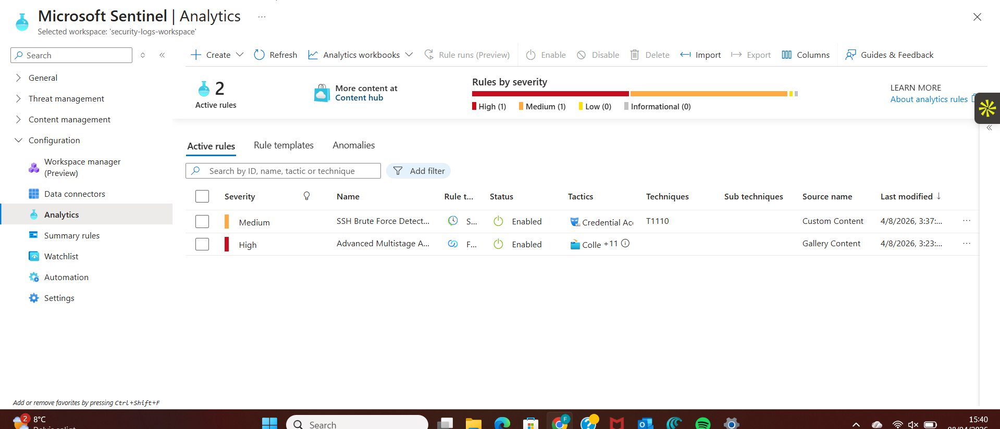

# Microsoft Sentinel SOC Lab

## Overview
This project demonstrates how to detect SSH brute force attacks using Microsoft Sentinel and Kusto Query Language (KQL).

The lab includes:

- Log ingestion from Azure Linux VM
- Detection of failed SSH login attempts
- Creation of Sentinel Analytics Rule
- MITRE ATT&CK mapping
- Security monitoring using SIEM

## Technologies Used

- Microsoft Sentinel
- Azure Monitor
- Log Analytics
- KQL (Kusto Query Language)
- MITRE ATT&CK

  ## Microsoft Sentinel Detection Rule

This rule detects multiple failed SSH login attempts from the same attacker IP.

### Detection Rule Configuration

## Detection Scenario

Attackers attempt brute-force SSH login attempts against a Linux VM.  
Sentinel analyzes logs and detects repeated failed authentication attempts.
