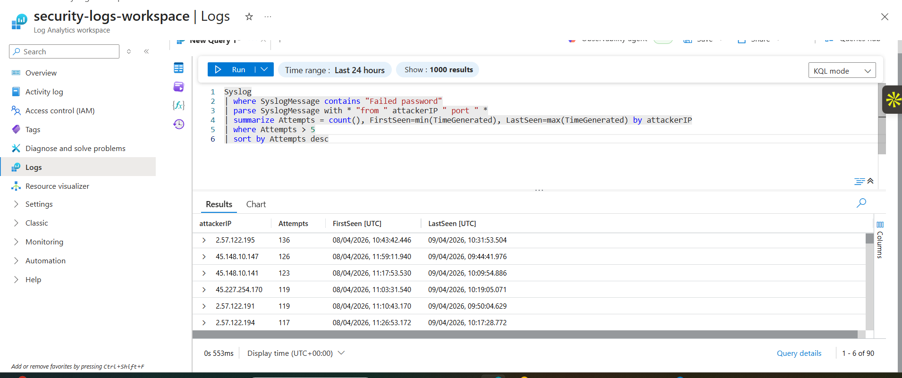
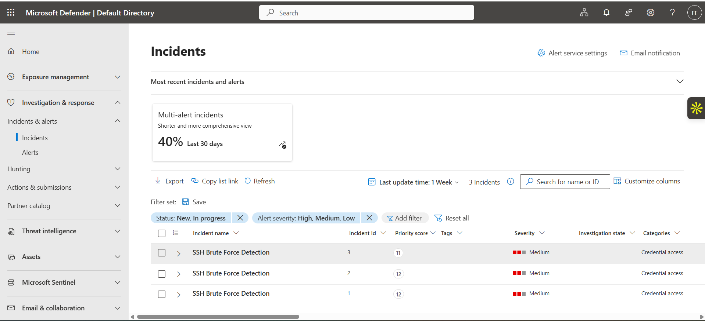
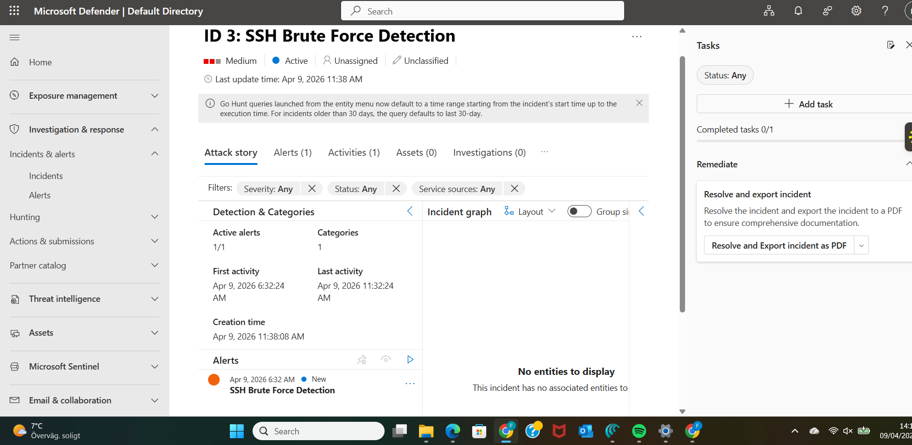

# Microsoft Sentinel SOC Lab

## Overview
This project demonstrates how to detect SSH brute force attacks using Microsoft Sentinel and Kusto Query Language (KQL).

The lab includes:

- Log ingestion from Azure Linux VM
- Detection of failed SSH login attempts
- Creation of Sentinel Analytics Rule
- MITRE ATT&CK mapping
- Security monitoring using SIEM

## Technologies Used

- Microsoft Sentinel
- Azure Monitor
- Log Analytics
- KQL (Kusto Query Language)
- MITRE ATT&CK

  ## Microsoft Sentinel Detection Rule

This rule detects multiple failed SSH login attempts from the same attacker IP.

### Detection Rule Configuration


## Detection Scenario

Attackers attempt brute-force SSH login attempts against a Linux VM.  
Sentinel analyzes logs and detects repeated failed authentication attempts.

Attackers attempted brute-force SSH login attempts against the Azure Linux VM.

The following KQL query was used to identify repeated failed login attempts:

```kql
Syslog
| where SyslogMessage contains "Failed password"
| parse SyslogMessage with * "from " attackerIP " port " *
| summarize Attempts = count(), FirstSeen=min(TimeGenerated), LastSeen=max(TimeGenerated) by attackerIP
| where Attempts > 5
| sort by Attempts desc
```

### Detected brute force activity



## Sentinel Incidents

After the detection rule triggered, Microsoft Sentinel automatically generated security incidents for the detected SSH brute force activity.




## Sentinel Incident Investigation

Opening the incident inside Microsoft Sentinel allows analysts to investigate the alert, view the attack timeline, and analyze the security event.


